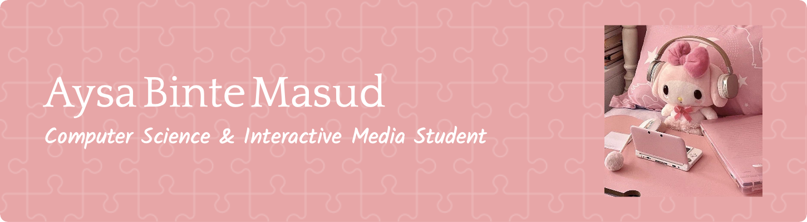

I am a Computer Science undergraduate at **New York University Abu Dhabi**, with a minor in Applied Mathematics and Interactive Media. My academic and professional experiences bridge **full-stack development, machine learning, computer vision, and accessibility-focused AI research**. I am passionate about building technologies that integrate technical depth with creative design to solve real-world problems in accessibility, health, and human–computer interaction.

---

### 🔧 Skills & Tools

* **Languages:** C++, Python, JavaScript (ES Modules), TypeScript, HTML, CSS, SQL, MATLAB
* **Frameworks & Libraries:** React, React Native, Express, Next.js, Node.js, Tailwind CSS, Leaflet.js, p5.js, MongoDB, Mongoose, MySQL, NoSQL, NumPy, Pandas, Scikit-learn, PyTorch, TensorFlow
* **Tools:** Git/GitHub, Docker, FastAPI, QGIS, Figma, Adobe Photoshop, Illustrator, After Effects, Procreate, Microsoft Office Suite, Excel
* **Other:** Machine Learning, Computer Vision, Data Science, Multimodal AI, Web Development, Embedded AI, Data Scraping, Digital Art & Animation

---

### 📚 Currently Exploring

* Applied Machine Learning & Multimodal AI
* Computer Vision
* Human–Robot Interaction and Real-Time AI Systems
* Design for Accessibility & Human-Centered Computing

---

### 🔍 Selected Projects

* **Research Assistant:** Developed and evaluated **computer vision pipelines** for embodied AI agents, including sign language understanding and human–robot interaction; optimized models for **real-time inference on edge devices (CUDA, NVIDIA Jetson)**.
* **ChatSign Technology (ML Intern):** Designed and fine-tuned **sign language translation models** using multimodal datasets; contributed to accessibility tools for **Deaf and Hard-of-Hearing communities**.
* **EZ247:** Real-time, voice-enabled AI assistant for university dining halls, integrating **Ollama-powered LLMs, FastAPI, and MCP servers**, achieving a **40% reduction in response latency** with GPU acceleration.
* **Medinity:** A React Native + Node/Express health app that helps users adhere to medicine schedules and make informed healthcare choices, powered by **OpenFDA integration**.
* **[math-confidence.com](http://math-confidence.com):** Interactive AI-powered learning platform with mini-tutors designed to boost student confidence in mathematics.
* **BistroMoods:** Mood-based restaurant finder leveraging **sentiment analysis, APIs, and map-based visualization**.
* **CozyCorner:** Roommate management platform for shared tasks, expenses, and community building.
* **AstroEcho:** Immersive digital experience transforming emotions into generative constellations.

---

### 🗣️ Interests

* **Artificial Intelligence & Accessibility** — Multimodal AI, Computer Vision, Human–Robot Interaction
* **Software Development** — Full-Stack Systems, Scalable Architectures, Data-Driven Applications
* **Creative Tech** — Digital Art, Animation, and Interactive Media Design
* **Global Exploration** — Passionate about travel, cross-cultural collaboration, and storytelling through tech and media

---

### 🔗 Connect

* [LinkedIn](https://www.linkedin.com/in/aysa-binte-masud-213150255/)
* [GitHub](https://github.com/aysa2018)

---

✨ *"Crafting intelligent and creative systems at the intersection of code, design, and impact."*

---

